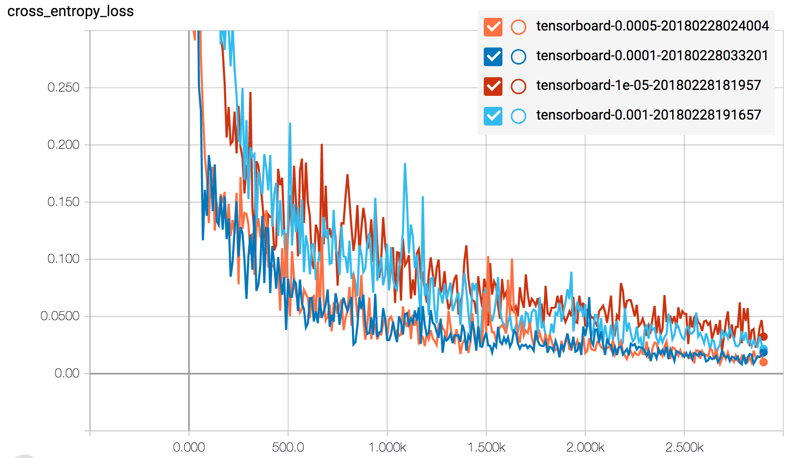

# Semantic Segmentation

#### Build the Neural Network

##### Does the project load the pretrained vgg model? (The function load_vgg is implemented correctly.)

The modified version of the VGG model


was recovered and unit tested in [load_vgg](https://github.com/autohandle/CarND-Semantic-Segmentation/blob/d636e902549a60b1a71e96a571ec4ef95a849ed8/main.py#L24-L54):

``` python
def load_vgg(sess, vgg_path):
...
    vgg_tag = 'vgg16'
...

    tf.saved_model.loader.load(sess, [vgg_tag], vgg_path)
...

    return image_input, keep_prob, layer3_out, layer4_out, layer7_out
tests.test_load_vgg(load_vgg, tf)
```

The recovered model was saved and then [displayed](images/OriginalTensorFlow.png) using tensorboard. An [image was passed through the model](https://github.com/autohandle/CarND-Semantic-Segmentation/blob/d2ac6f72f1d499f548dc4c9c9be522228009bd58/helper.py#L162-L176)

``` python
def showTensorSizes(dictionary, session):
    graph=session.graph
    session.run(tf.global_variables_initializer())
    print("showTensorSizes-global variables:\n", [n.name for n in tf.get_default_graph().as_graph_def().node])
    for tensorName in tensorNames:
        layer=graph.get_tensor_by_name(tensorName)
        #print ("showTensorSizes-tensorName:", tensorName, ", layer:", layer)
        layer_eval=layer.eval(feed_dict=dictionary)
        isLayerAnArray=isinstance(layer_eval,np.ndarray)
        #print ("showTensorSizes-tensorName:", tensorName, ", layer_eval.type:", type(layer_eval), ", isLayerAnArray? ", isLayerAnArray)
        if (isLayerAnArray):
            print ("showTensorSizes-tensorName:", tensorName, ", type:",type(layer_eval), ", shape:", layer_eval.shape)
        else:
            print ("showTensorSizes-tensorName:", tensorName, ", layer:", layer, ", layer_eval:", layer_eval)
```

and the tensors were displayed to obtain the tensor sizes for nodes in the graph which encoded the RGB image from `160x576x3` to `5x18x4096`.


##### Does the project learn the correct features from the images? (The function layers is implemented correctly.)

The `5x18x4096` encoded VGG tensor [was decoded](https://github.com/autohandle/CarND-Semantic-Segmentation/blob/d2ac6f72f1d499f548dc4c9c9be522228009bd58/main.py#L74-L102) by using `conv2d_transpose` to increase the size of the tensor X and Y:

```python
def convT(suffix, input, numberOfChannels, filterSize, strideSize):
    convolutionName="convT_"+str(suffix)
    if REGULARIZEDLAYERS:
        return tf.layers.conv2d_transpose(input, numberOfChannels, filterSize, strideSize, padding="same",
            kernel_initializer= tf.random_normal_initializer(stddev=STANDARDDEVIATION), name=convolutionName,
            kernel_regularizer=tf.contrib.layers.l2_regularizer(1.e-3))
    else:
        return tf.layers.conv2d_transpose(input, numberOfChannels, filterSize, strideSize, padding="same",
            kernel_initializer= tf.random_normal_initializer(stddev=STANDARDDEVIATION), name=convolutionName)

def increaseXY(suffix, input, ratio):
    #print("increaseXY-filterSize:", ratio, ", input:", input)
    numberOfChannels=input.shape[3]
    return convT(suffix, input, numberOfChannels, ratio, ratio)
```

and used `conv2d` to decrease the number of channels:

``` python
def conv(suffix, input, numberOfChannels, filterSize, strideSize):
    convolutionName="conv_"+str(suffix)
    if REGULARIZEDLAYERS:
        return tf.layers.conv2d(input, numberOfChannels, filterSize, strideSize, padding="same",
            kernel_initializer= tf.random_normal_initializer(stddev=STANDARDDEVIATION), name=convolutionName,
            kernel_regularizer=tf.contrib.layers.l2_regularizer(1.e-3))
    else:
        return tf.layers.conv2d(input, numberOfChannels, filterSize, strideSize, padding="same",
            kernel_initializer= tf.random_normal_initializer(stddev=STANDARDDEVIATION), name=convolutionName)

def reduceChannels(suffix, input, numberOfChannels):
    #print("reduceChannels-input:", input)
    return conv(suffix, input, numberOfChannels, 1, 1)
```

The [layers function](https://github.com/autohandle/CarND-Semantic-Segmentation/blob/d2ac6f72f1d499f548dc4c9c9be522228009bd58/main.py#L121-L162) creates an [decoder](images/DecoderNoAdd.png) that alternates `reduceChannels` and `increaseXY` to first change the encoded tensor from `5x18x4096` to `160x576x32` which was the original XY size of the image. Finally, a 1x1 convolution is used to reduce the number of channels to 2 giving a final image size of `160x576x2`.


After the decoder resized the tensor to `160x576x2`, the (feed forward) [skip connection layers](./images/Decoder.png) (from layer-3 and layer-4) were added:


##### Does the project optimize the neural network? (The function optimize is implemented correctly.)

The [optimize function](https://github.com/autohandle/CarND-Semantic-Segmentation/blob/d2ac6f72f1d499f548dc4c9c9be522228009bd58/main.py#L181-L205) flattens the both output image and the annotated image:

``` python
logits = tf.reshape(nn_last_layer, (-1, num_classes))
correct_label = tf.reshape(correct_label, (-1,num_classes))
```

then calculates the crosss entropy loss:

``` python
cross_entropy_loss = tf.reduce_mean(tf.nn.softmax_cross_entropy_with_logits(logits= logits, labels= correct_label))
```

that will be minimized by the Adams optimizer:

``` python
optimizer = tf.train.AdamOptimizer(learning_rate=learning_rate)
train_op = optimizer.minimize(cross_entropy_loss)
```

##### Does the project train the neural network? (The function train_nn is implemented correctly. The loss of the network should be printed while the network is training.)

The [training function](https://github.com/autohandle/CarND-Semantic-Segmentation/blob/d2ac6f72f1d499f548dc4c9c9be522228009bd58/main.py#L207-L274) initializes the tensorflow graph

``` python
sess.run(tf.global_variables_initializer())
```

then runs,  for each epoch, each image batch that is generated by `get_batches_fn`. First, a dictionary for the tensorflow placeholders is created:

``` python
dictionary={input_image: image, correct_label: label,
keep_prob: 0.5, learning_rate: LEARNINGRATE}
```

and then each batch from `get_batches_fn` is used to optimize the graph:

``` python
for i in range(epochs):
   print("EPOCH {} (of {})".format(i+1, epochs))
   batch=0
   for image, label in get_batches_fn(batch_size):

   ...

        _, loss, summary=sess.run([train_op, cross_entropy_loss, mergedSummary], 
        feed_dict=dictionary)
```
#### Neural Network Training

##### Does the project train the model correctly? (On average, the model decreases loss over time.)

The [optimize function](https://github.com/autohandle/CarND-Semantic-Segmentation/blob/d2ac6f72f1d499f548dc4c9c9be522228009bd58/main.py#L181-L205) tracks the cross entropy loss:

``` python
def optimize(nn_last_layer, correct_label, learning_rate, num_classes):
...
    cross_entropy_loss = tf.reduce_mean(tf.nn.softmax_cross_entropy_with_logits(logits= logits, labels= correct_label))
    tf.summary.scalar("cross_entropy_loss", cross_entropy_loss)
```

The [training function](https://github.com/autohandle/CarND-Semantic-Segmentation/blob/d2ac6f72f1d499f548dc4c9c9be522228009bd58/main.py#L207-L274) adds both the  graph and the cross entropy loss to the tensorboard log:

``` python
helper.TensorboardWriter.add_graph(sess.graph)
mergedSummary=tf.summary.merge_all()

...

_, loss, summary=sess.run([train_op, cross_entropy_loss, mergedSummary], 
feed_dict=dictionary)
```

The tensorboard displays the cross entropy loss and by varying the `LEARNINGRATE` hyperparameter, the best rate can be selected.



##### Does the project use reasonable hyperparameters? (The number of epoch and batch size are set to a reasonable number.)

The number of epochs was increased until the loss function leveled out and then the best LEARNINGRATE was selected.


##### Does the project correctly label the road? (The project labels most pixels of roads close to the best solution. (The model doesn't have to predict correctly all the images, just most of them.)

The quality of the labeling varies based on the texture consistency in the image:


